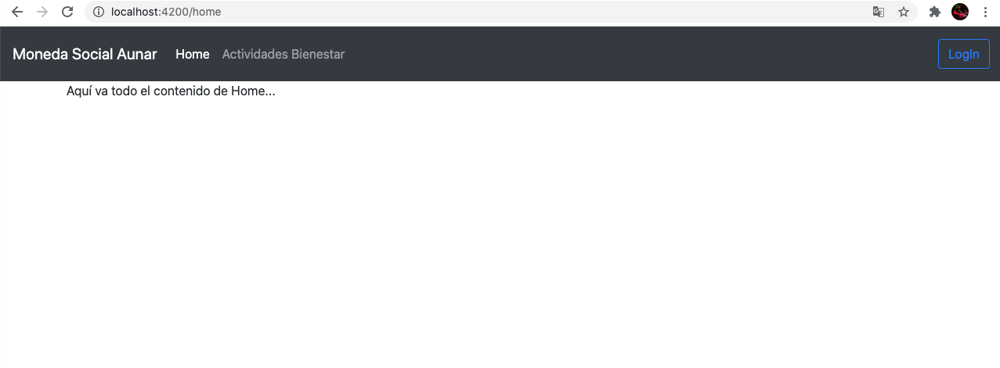
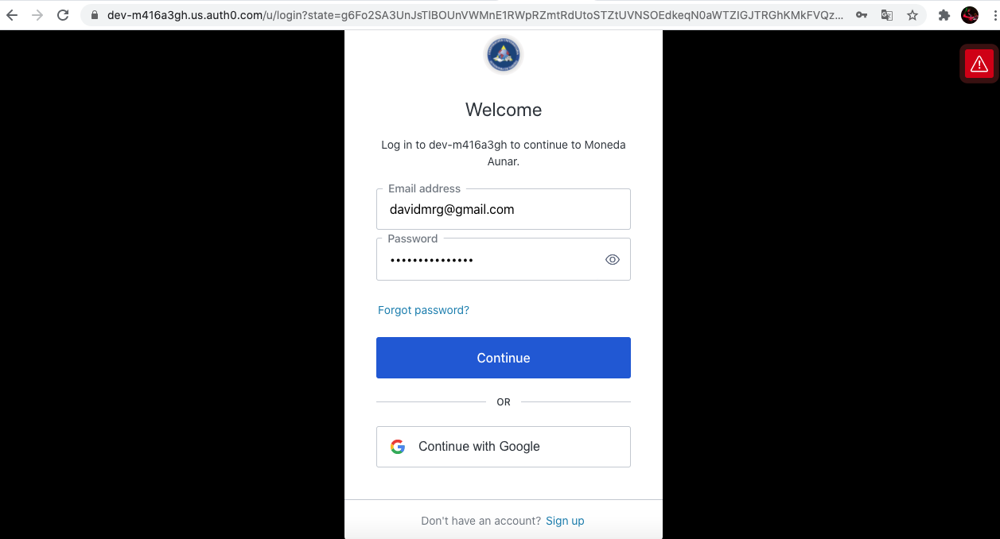
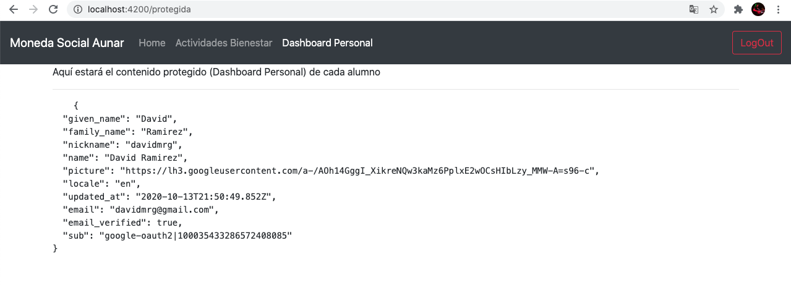

# Authapp - Módulo de Login en Angular usando tecnología de Auth0 - Authentication as a Service (AaaS) 

Este proyecto fue generado con [Angular CLI](https://github.com/angular/angular-cli) version 10.0.3.

## Development server

Ejecutar `ng serve` para un servidor de desarrollo. Abrir en navegador `http://localhost:4200/`. La aplicación se refrescará automáticamente si se hace algún cambio en el código fuente.

## Pantalla Home sin login:

## Pantalla Login (Auth0):

## Pantalla Dashboard en una ruta protegida (después de Login):

## Ayuda adicional

Para obtener ayuda acerca del Angular CLI use `ng help` o visite [Angular CLI README](https://github.com/angular/angular-cli/blob/master/README.md).

Para obtener ayuda sobre la implementación de Auth0 en Angular visite https://github.com/auth0-samples/auth0-angular-samples/blob/auth0-spa-js.latest/01-Login/TUTORIAL.md
